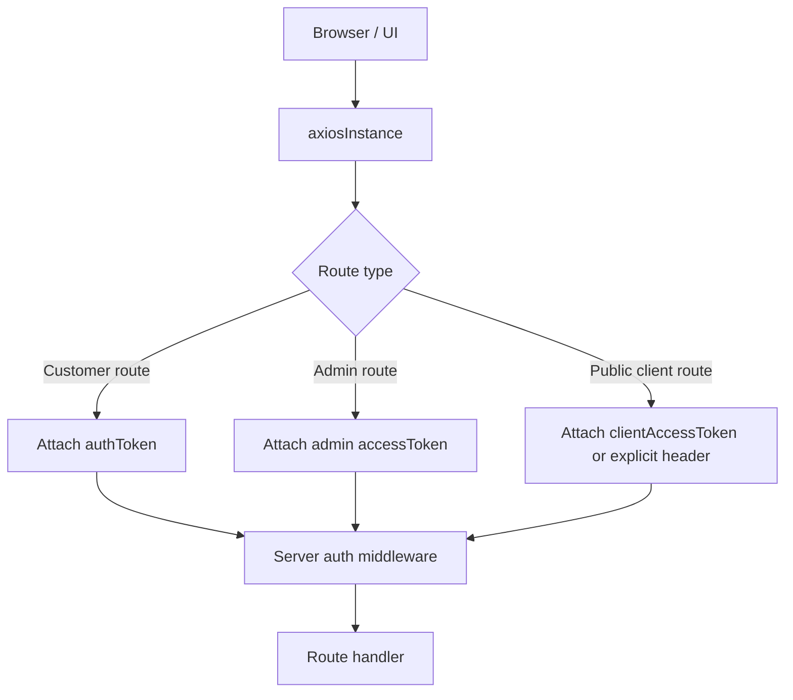

# MassClick Auth Architecture

This document explains how authentication currently works in the app, how the different login types are stored, and how API access is decided on both the client and server.

## 1. High-Level Model

MassClick currently has three session types:

| Session type | Storage keys | Used by | Token source |
| --- | --- | --- | --- |
| Admin OAuth | `accessToken`, `refreshToken`, `accessTokenExpiresAt`, `userRole`, `userName`, `allowedPages` | Admin dashboard and admin-only APIs | `/api/oauth/login`, `/api/oauth/relogin`, `/api/oauth/client` |
| Customer OTP | `authToken`, `authUser` | Customer profile, leads, favorites, chat, FCM token actions | OTP login flow |
| Public client credentials | `clientAccessToken`, `clientRefreshToken`, `clientAccessTokenExpiresAt`, `device_id` | Browser/device-level public client APIs | `/api/oauth/client` |

## 2. Request Flow

The client decides which token to send in `client/ui-app/src/services/axiosInstance.js`.

## 3. Client-Side Auth Storage

The auth store lives in `client/ui-app/src/auth/authStore.js`.

### Admin session

- Stored under `accessToken`, `refreshToken`, `accessTokenExpiresAt`
- Used by admin pages and admin OAuth API calls
- Expires are checked in the browser
- A `401` response triggers refresh through `/api/oauth/relogin`

### Customer session

- Stored under `authToken` and `authUser`
- Created after OTP verification
- Represents the logged-in end user
- Used for customer profile and self-service APIs

### Public client session

- Stored under `clientAccessToken`, `clientRefreshToken`, `clientAccessTokenExpiresAt`, `device_id`
- Created by client-credentials login
- Used for device/browser scoped public client access
- This is not the same as the customer OTP session

## 4. Login Flows

### 4.1 Admin login

Files:

- `server/routes/oauthRoutes.js`
- `server/helper/oauthHelper.js`
- `client/ui-app/src/services/axiosInstance.js`
- `client/ui-app/src/auth/authStore.js`

Flow:

1. Admin submits credentials to `/api/oauth/login`.
2. Server validates credentials and returns OAuth access/refresh tokens.
3. Client stores them in admin storage keys.
4. Every admin request sent through `axiosInstance` gets the admin access token.
5. If the admin access token expires, the interceptor calls `/api/oauth/relogin`.
6. On successful refresh, the new admin tokens are stored and the original request is retried.

### 4.2 Customer OTP login

Files:

- `server/routes/msg91Routes.js`
- `server/controller/msg91/msg91Controller.js`
- `client/ui-app/src/redux/actions/otpAction.js`
- `client/ui-app/src/auth/authStore.js`

Flow:

1. Customer requests OTP through `/api/otp_user/send-otp` or `/api/otp/send`.
2. Server verifies or generates the OTP.
3. Customer submits the OTP to `/api/otp_user/verify-otp` or `/api/otp/verify`.
4. Server creates a JWT-like customer token and returns the customer user object.
5. Client stores the token in `authToken` and the profile in `authUser`.

Important:

- This session is not refreshed by the admin OAuth refresh flow.
- If `authToken` is missing, customer-only APIs will return `AUTH_REQUIRED`.

### 4.3 Public client credentials login

Files:

- `server/helper/oauthHelper.js`
- `client/ui-app/src/redux/actions/clientAuthAction.js`

Flow:

1. Browser/device calls `/api/oauth/client` with `client_id`, `client_secret`, and a generated `device_id`.
2. Server returns a public-client access token.
3. Client stores it in `clientAccessToken` and related fields.
4. `getClientToken()` renews it when expired by calling `clientLogin()` again.

This flow is used for browser/device-scoped access, not customer profile access.

## 5. Server Auth Layers

### 5.1 Global `/api` rate limit

File:

- `server/app.js`
- `server/middleware/rateLimitMiddleware.js`

The whole `/api` tree is protected by a global rate limiter:

- `app.use("/api", apiRateLimit);`

This limiter is separate from authentication.

### 5.2 OAuth middleware

File:

- `server/helper/oauthHelper.js`

`oauthAuthentication` accepts:

- `admin`
- `publicClient`

That means routes using this middleware can be served by either admin OAuth tokens or public-client tokens, depending on the route and controller logic.

### 5.3 Policy-based auth

Files:

- `server/auth/authMiddleware.js`
- `server/auth/authPolicyRegistry.js`

`requireAuthPolicy(policyKey)` resolves a policy from the registry and enforces the allowed actor types.

Examples:

- `otp.profile.view` allows `customer` and `admin`
- `otp.profile.update` allows `customer` and `admin`
- `otp.profile.list` allows only `admin`
- `leads.customer.list` allows `customer` and `admin`
- `fcm.web-register` allows `customer`
- `fcm.list` allows only `admin`

### 5.4 Self-only mobile guard

File:

- `server/auth/authMiddleware.js`

`assertSelfOnlyMobileAccess()` blocks access unless:

- the request has a valid auth actor, and
- the requested mobile matches the logged-in customer mobile, unless the actor is admin

This is what protects endpoints like:

- `/api/otp_user/:mobile`
- `/api/otp_user_update/:mobile`
- `/api/leadsData/leads/:mobileNumber`

## 6. Which APIs Use Which Auth

### Admin-only APIs

These generally use `oauthAuthentication` or `requireAdminAuth`:

- System settings
- Cache and Redis admin tools
- User/client/category/business/SEO CRUD routes
- FCM admin routes
- Msg91 analytics admin routes
- `GET /api/otp_users`
- `DELETE /api/otp_user/:mobile`
- `GET /api/admin/auth/*`

### Customer/self-service APIs

These use customer OTP auth or self-only policies:

- `POST /api/otp_user/send-otp`
- `POST /api/otp_user/verify-otp`
- `GET /api/otp_user/:mobile`
- `PUT /api/otp_user_update/:mobile`
- `POST /api/otp_user/log-search`
- `GET /api/leadsData/leads/:mobileNumber`
- `GET /api/leadsData/analytics/summary/:mobileNumber`
- `GET /api/leadsData/analytics/trends/:mobileNumber`
- `GET /api/leadsData/analytics/top-searches/:mobileNumber`
- `POST /api/fcm-token/web-register`
- `POST /api/fcm-token/save`
- `PUT /api/fcm-token/refresh/:userId/:oldToken`
- `DELETE /api/fcm-token/remove/:userId/:token`

### Public client / device-scoped APIs

These use the public client credentials flow through `oauthAuthentication` or explicit client token logic:

- `POST /api/oauth/client`
- some browser/device-scoped endpoints that accept `admin` or `publicClient` through `oauthAuthentication`

## 7. Client Request Selection

The client chooses which token to send in `client/ui-app/src/services/axiosInstance.js`.

Current behavior:

- customer routes such as `/api/otp_user/*` and `/api/leadsData/*` use the customer OTP token
- admin routes use the admin OAuth token
- if a route already sets `Authorization`, axios preserves it
- if no matching session exists, the request may still be sent without auth and the server will reply with `AUTH_REQUIRED`

That is why you were seeing:

- `AUTH_REQUIRED` on `/api/otp_users`
- `AUTH_REQUIRED` on `/api/otp_user/:mobile`
- `AUTH_REQUIRED` on `/api/leadsData/leads/:mobileNumber`

Those endpoints require the correct session type.

## 8. Common Error Meanings

| Error | Meaning |
| --- | --- |
| `AUTH_REQUIRED` | No usable token was sent |
| `INVALID_TOKEN` | Token was present but rejected |
| `AUTH_EXPIRED` | Token expired |
| `FORBIDDEN` | Token was valid but the actor type or ownership rules do not allow the action |

## 9. Practical Rules For Adding New APIs

When adding a new endpoint:

1. Decide whether it is admin, customer, or public-client scoped.
2. Pick the right middleware:
   - `oauthAuthentication`
   - `requireAuthPolicy(...)`
   - `requireAdminAuth(...)`
   - `assertSelfOnlyMobileAccess(...)`
3. Make sure the client sends the correct token type.
4. Add a rate-limit rule if the endpoint is sensitive.
5. If it is customer-facing, make sure the UI does not call it before login.

## 10. Useful Files

- `server/app.js`
- `server/helper/oauthHelper.js`
- `server/auth/authMiddleware.js`
- `server/auth/authResolver.js`
- `server/auth/authPolicyRegistry.js`
- `server/routes/oauthRoutes.js`
- `server/routes/msg91Routes.js`
- `server/routes/leadsDataRoutes.js`
- `client/ui-app/src/auth/authStore.js`
- `client/ui-app/src/services/axiosInstance.js`
- `client/ui-app/src/redux/actions/otpAction.js`
- `client/ui-app/src/redux/actions/clientAuthAction.js`
- `client/ui-app/src/redux/actions/leadsAction.js`

